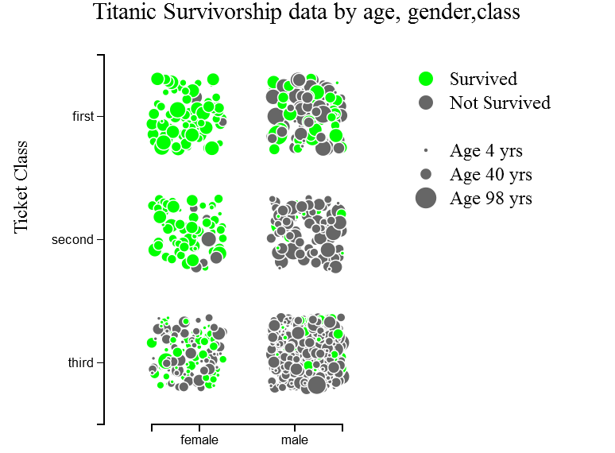
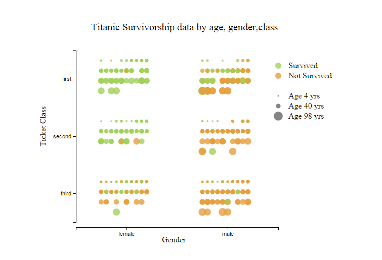
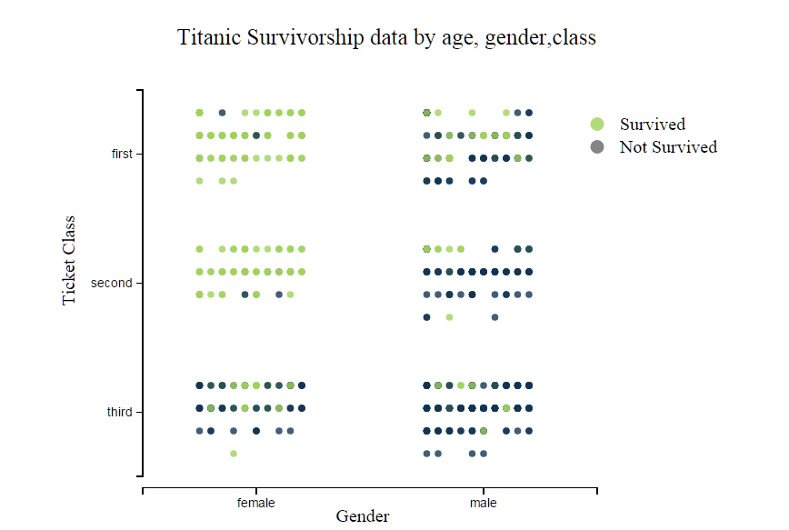
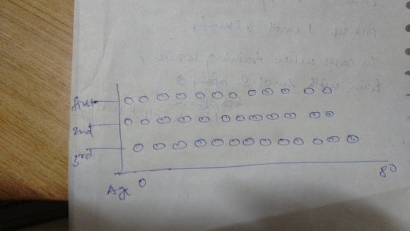
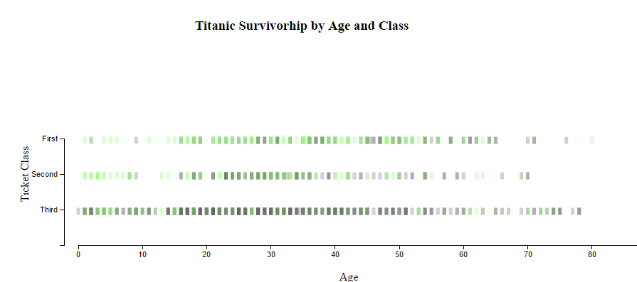

### Data Visualization Process

Update : The latest version can be seen [here](https://rawgit.com/avs20/DataVisualization/master/index_2.html)

This is the initial idea that I am starting to work on

* Survival will be shown in green for yes and red for no.
* The passengers will be represented by bubbles (circles). The size of the 
* circle will represent the age of the passengers.
* On the x-axis we have gender in two columns of men and women.
* On the y-axis we have 3 columns representing the class of the passengers.

Based on the intuition and data I think there will be big red circles in the
bottom left and and small green circles in the top right.

I made a quick plot in R to check if this plot will be as telling as I am thinking.

So from the first sight. This plot tells that women survival chances were better
, especially in the First Class and less in 3rd class. The men who survive
were mostly either children or in the First class.

Now I will try to plot it in dimple.js

Well I plotted it with d3.js  more complicated than dimple but I was able to 
pick it up and make a readable plot. Here is how it looks

This looked somwhat better than the R-plot and sketch. First I used the green
color for survived and gray for the others. I didn't choose any other bright 
color because I wanted to put the users mind directly on who has survived which
green and grey combination does well on that.

The main problem with this plot is incomprehensible age data. I thought that
age data represented as circle size will easily tell that children survived 
but this didn't worked small green dots were almost invisible to the naked eye 
even though they were there. Sometimes they were hidden by bigger circle and 
sometimes due to jitter we lose them. Since age is also a factor as told by 
people in feedback. So here is what I am thinking next. 

The plot will be almost same just this time it will be more regularized.
Instead of randomly placing the circles in the strip of class I am gonna place 
them in increments of age. So like in third class and the female block the first
line will contain the small circles as age less ==> small circle, then in second
line the circles will be bigger and so on. This will be done in all the blocks
of class and gender and hence in the new plot we can see age clearly and 
comprehend.
Here is a rough sketch on paper and pen.

I acheived the effect that I wanted to acheive and here is the plot

The plot now looks beautiful. I changed the color used for the not survived and 
arranged the circles by their age size. There are some concentric circles
representing that at same age some individuals survived and others not. There
are also some big circles in between the smaller circles which should not be 
there. 

The [feedback](Feedback.md) also reports this and I am working on the next 
version. 

Age needs more work as on dividing the tickets into age group the age legend is 
now obsolete and adds confusion(still). I am going to make all points of 
same size and just arrange them. The concentric circles effect will still be
present.

Here is the plot 

Well I made the plot but now I am confused. 

* The colors are darkened based on the number of persons at that age level. 
* I also need to add scale/guide about what each row suggests. (age group 
intervals)

The biggest question I am thinking about is what each point represents now? 
Also the plot intensity is not discriminating enough to represent many 
individuals at that age.

Now I am going to put every individual as a point (2px) on the plot and then see
how it looks. Putting every individual will take too much real estate. 

Here is a rough sketch of how it will look 

I started plotting with the circles but they were still overlapping and there 
was no way to represent density at an age group. Based on the suggestion I 
updated it to use rectangles to show density. 

I plotted the sketch in d3 and it looks like 

This still doesn't look right. I am missing something here and I don't know 
where I am going with this plot. So I got back to pen and paper and wrote 
my purpose. What I wanted to show with this plot. 

    Survival is biased towards Rich and Low Age Individual 

Now this clears some air. My plot will be simple that each rectangle will 
display an age  and the color of that rectangle will be based on the survival 
at that age. If the survival is greater than 50 % then it will be from green 
pallete and if survival is less than 50 % then it will be from grey pallete. 

For this I will have to make some data changes like this 
{
 age : 24,
 total_at_class1 : 10,
 survived_at_class1 : 2,
 total_at_class2 : 10,
 survived_at_class2 : 2,
 total_at_class3 : 10,
 survived_at_class3 : 2,
 survival_at_class_1 : 0.2,
 survival_at_class_2 : 0.3,
 survival_at_class_3 : 0.4,
}

Then I can also show information at hover regarding this and also filter the 
data based on males and females. 

Yes this will be my final plot. 

