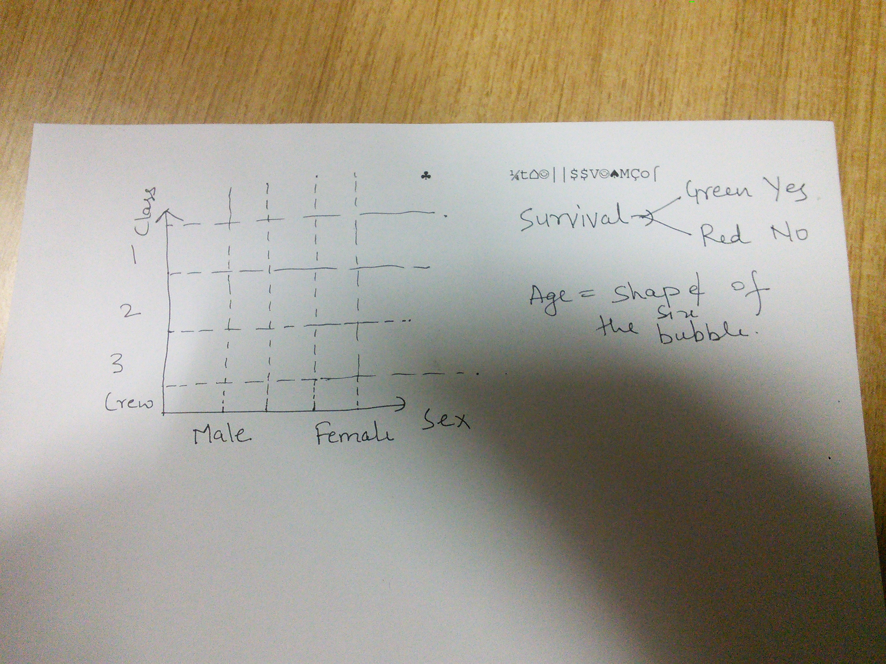
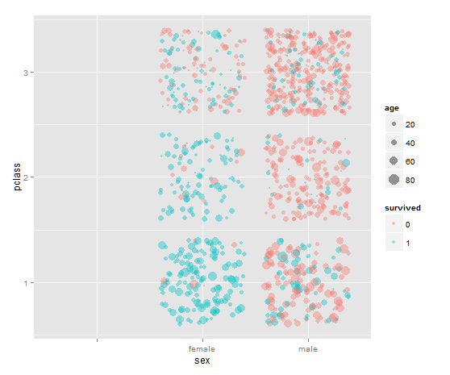

### Data Visualization Process

This is the initial idea that I am starting to work on

* Survival will be shown in green for yes and red for no.
* The passengers will be represented by bubbles (circles). The size of the circle will represent the age of the passengers.
* On the x-axis we have gender in two columns of men and women.
* On the y-axis we have 3 columns representing the class of the passengers.

Based on the intuition and data I think there will be big red circles in the bottom left and and small green circles in the top right.

I made a quick plot in R to check if this plot will be as telling as I am thinking.

So from the first sight. This plot tells that women survival chances were better, especially in the First Class and less in 3rd class. The men who survive were mostly either children or in the First class.

Now I will try to plot it in dimple.js
